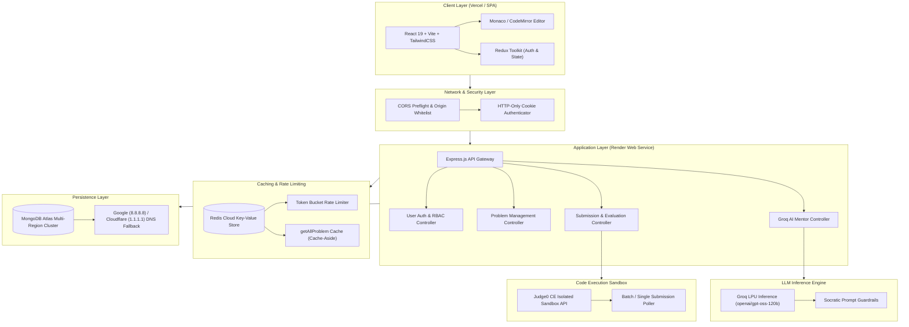
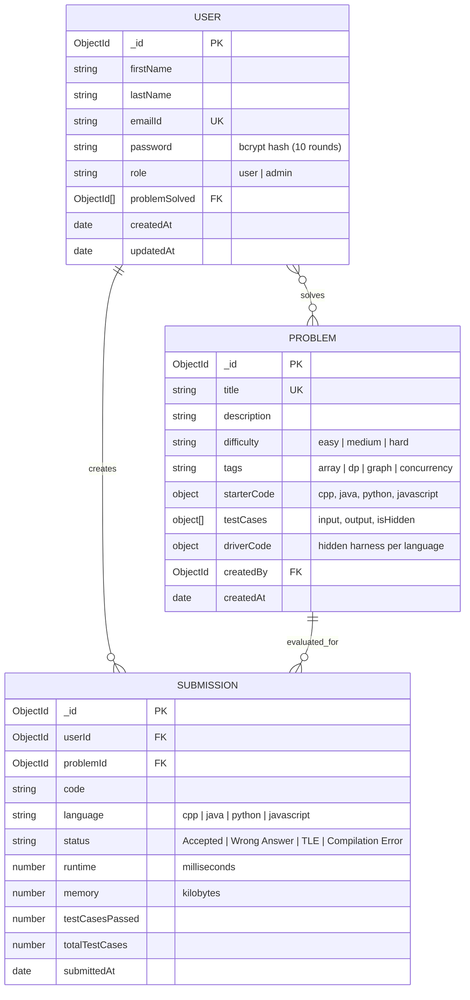
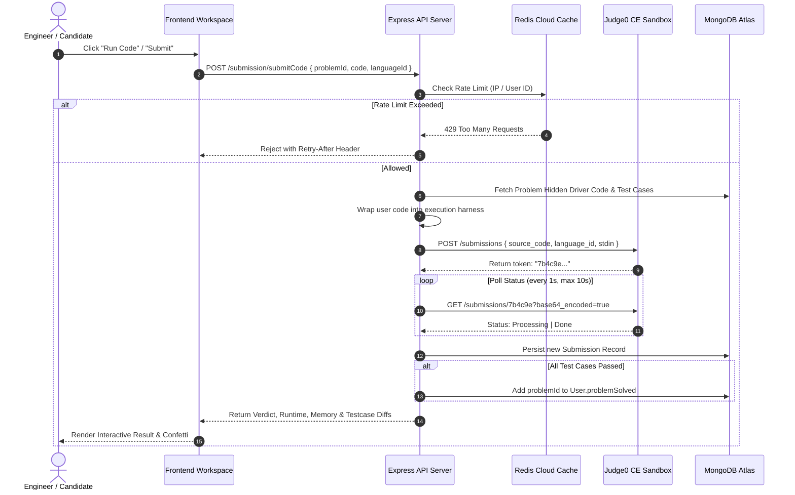
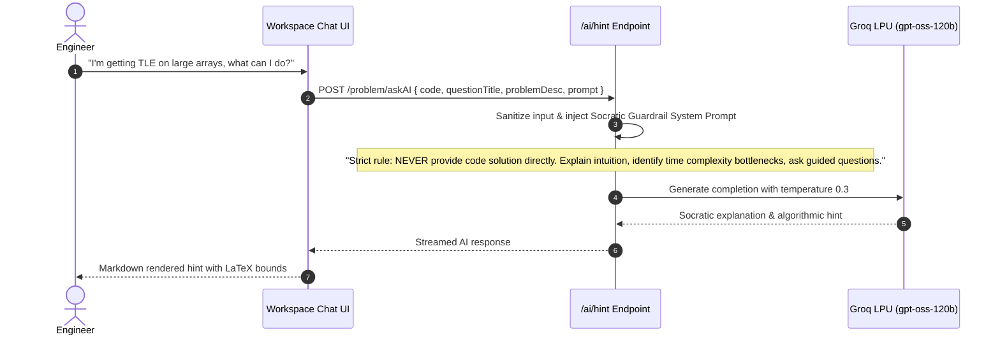

# ⚡ CodeForge — Next-Generation DSA & Socratic AI Coding Platform

[](https://github.com/VaishnavAron/CodeForge/actions/workflows/ci.yml)
[](https://nodejs.org/)
[](https://react.dev/)
[](https://tailwindcss.com/)
[](https://www.mongodb.com/)
[](https://redis.io/)
[](https://groq.com/)
[](LICENSE)

**CodeForge** is an enterprise-grade, full-stack algorithmic problem-solving platform designed as a modern, high-performance alternative to LeetCode. Built with **React 19**, **Node.js/Express**, **Redis Cloud**, **MongoDB Atlas**, **Judge0 Sandbox**, and **Groq LPU Socratic AI inference**, CodeForge enables engineers to practice 103+ curated DSA challenges with sub-second feedback, real-time code execution, and guidance that never spoils the solution.

---

## 🏛️ High-Level Design (HLD)

### System Architecture Overview



### Architectural Design Decisions

1. **Decoupled Client & Server:** The client is an optimized static SPA hosted on Vercel's global Edge CDN, while the API is a stateless Express.js service hosted on Render with automatic horizontal scale capability.
2. **Asynchronous Execution Model:** Code compilation and execution are delegated to an isolated sandboxed worker engine (Judge0 CE). The backend signs the payload, submits to the queue, and polls the token status asynchronously, ensuring that long-running user scripts never block Express event loop threads.
3. **Sub-400ms Socratic AI Mentoring:** Integrated with Groq LPU inference to process the user's live code AST, language context, and problem statement with sub-second latency, providing contextual guidance rather than verbatim code leaks.
4. **Multi-Tier Cache & Failover:** Redis Cloud caches high-traffic read operations (`getAllProblem`), invalidating only on admin mutations. A built-in Node DNS resolver override (`dns.setServers`) prevents ISP SRV record drops on residential networks connecting to MongoDB Atlas.

---

## 🔬 Low-Level Design (LLD)

### 1. Database Schemas (MongoDB / Mongoose)



### 2. End-to-End Submission & Execution Flow



### 3. Socratic AI Mentor Flow



---

## ✨ Features & Capabilities

- 🎯 **103+ Curated Algorithm Challenges:** Complete catalog across Arrays, Dynamic Programming, Trees, Graphs, and Concurrency.
- ⚡ **Groq LPU Socratic AI:** Sub-400ms AI mentor providing complexity analysis, bug diagnosis, and conceptual nudges without giving away answers.
- 🛡️ **Multi-Language Sandboxed Execution:** Run and evaluate C++, Java, Python, and JavaScript inside isolated Judge0 environments.
- 🔒 **Role-Based Access Control (RBAC):** Distinct permissions for `user` and `admin` accounts. Admins can create, update, and manage problems.
- 🚀 **Redis Accelerated Caching:** Sub-millisecond problem catalog lookups with cache-aside invalidation.
- 📱 **Fully Responsive Modern UI:** Glassmorphic design built with TailwindCSS, featuring Monaco Code Editor, bottom console drawer, and responsive navigation drawer.
- 💳 **Premium Experience Preview:** Interactive upgrade modal highlighting public beta benefits and future Stripe/Razorpay integration.

---

## 🛠️ Tech Stack & Dependencies

| Layer | Technologies |
| :--- | :--- |
| **Frontend** | React 19, Vite, TailwindCSS, DaisyUI, Monaco Editor, Framer Motion, Lucide Icons, Redux Toolkit, Axios |
| **Backend** | Node.js, Express.js, Mongoose, Redis Client, JSON Web Tokens (JWT), Bcrypt, Dotenv |
| **Databases & Cache** | MongoDB Atlas (NoSQL persistence), Redis Cloud (In-memory caching & rate limiting) |
| **Execution Sandbox**| Judge0 CE Sandbox Engine |
| **AI Inference** | Groq LPU Inference API (`openai/gpt-oss-120b`) |
| **Deployment** | Vercel (Frontend SPA), Render (Backend Web Service) |

---

## 🚀 Quickstart & Local Development

### 1. Clone the Repository
```bash
git clone https://github.com/<YOUR_USERNAME>/CodeForge.git
cd CodeForge
```

### 2. Backend Setup
```bash
cd backend
npm install
cp .env.example .env
```
Fill in your `.env` variables:
```env
PORT=7000
DB_CONNECT_STRING=your_mongodb_atlas_connection_string
JWT_KEY=your_secure_random_jwt_secret
REDIS_PASS=your_redis_password
JUDGE0_URL=https://ce.judge0.com
GROQ_API_KEY=your_groq_api_key
GROQ_MODEL=openai/gpt-oss-120b
CLIENT_URL=http://localhost:5173
NODE_ENV=development
```
Start the backend server:
```bash
npm run dev
# or: node src/index.js
```

### 3. Frontend Setup
```bash
cd ../frontend
npm install
cp .env.example .env
```
Start the Vite development server:
```bash
npm run dev
```
Open [http://localhost:5173](http://localhost:5173) in your browser.

---

## ☁️ Production Deployment Guide

### Deploy Backend (Render)
1. Link your GitHub repository to [dashboard.render.com](https://dashboard.render.com/).
2. Create a **Web Service** with:
   - **Root Directory:** `backend`
   - **Build Command:** `npm install`
   - **Start Command:** `node src/index.js`
3. Add your production environment variables (`DB_CONNECT_STRING`, `JWT_KEY`, `REDIS_PASS`, `JUDGE0_URL`, `GROQ_API_KEY`, `CLIENT_URL`, `NODE_ENV=production`).

### Deploy Frontend (Vercel)
1. Import your GitHub repository on [vercel.com](https://vercel.com/).
2. Set **Root Directory** to `frontend`.
3. Add environment variable:
   - `VITE_BACKEND_URL`: Your deployed Render backend URL (e.g. `https://codeforge-api.onrender.com`).
4. Click **Deploy**.

---

## 📄 License
This project is licensed under the MIT License — feel free to use, modify, and distribute for personal and commercial projects.
